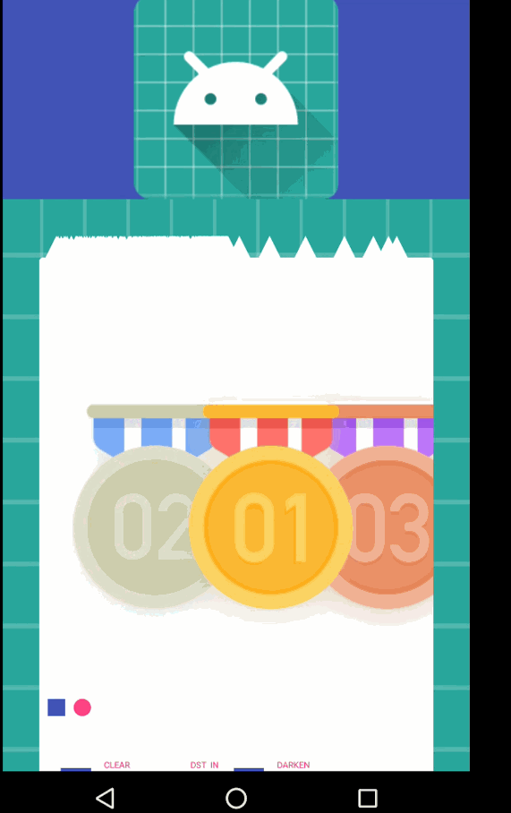

# UCHeaderViewDemo
高仿UC头部动画，杀鸡焉用牛刀

compile 'com.ym.widget.layout:collapsingdoubleheadbarlayout:0.0.1'

         <android.support.design.widget.AppBarLayout
                  android:id="@+id/app_bar"
                  android:layout_width="match_parent"
                  android:layout_height="@dimen/app_bar_height"
                  android:fitsSystemWindows="true"
                  android:background="@android:color/transparent"
                  android:theme="@style/AppTheme.AppBarOverlay">
          
                  <com.ym.widget.layout.collapsingdoubleheadbarlayout.CollapsingDoubleHeadbarLayout
                      android:id="@+id/collapsHeaderbar"
                      android:layout_width="match_parent"
                      android:layout_height="@dimen/app_bar_height"
                      app:layout_scrollFlags="scroll|exitUntilCollapsed|snap"
                      app:bottomLayoutId="@+id/bootom"
                      app:topLayoutId="@+id/title">
          
                      <ImageView
                          android:layout_width="match_parent"
                          android:layout_height="match_parent"
                          android:background="@color/colorPrimary"
                          android:src="@mipmap/ic_launcher"
          
                          />
          
                      <TextView
                          android:id="@+id/title"
                          android:layout_width="match_parent"
                          android:layout_height="48dp"
                          android:background="@android:color/white"
                          android:gravity="center"
                          android:text="@string/app_name"
                          android:textColor="@android:color/black"
                          />
          
                      <TextView
                          android:id="@+id/bootom"
                          android:layout_width="match_parent"
                          android:layout_height="48dp"
                          android:background="@android:color/white"
                          android:gravity="center"
                          android:text="@string/app_name"
                          android:textColor="@android:color/black"
                          />
          
                  </com.ym.widget.layout.collapsingdoubleheadbarlayout.CollapsingDoubleHeadbarLayout>
          
          
              </android.support.design.widget.AppBarLayout>
